# Spec-Atlas — End-to-End Architecture

> Reference architecture for **Spec-Atlas**, an "Industrial Knowledge Intelligence" / Operations-Brain platform.
> This document is **verified against the code at `main`** (commit `94c38f5`), not against the specs. Where code and
> specs/older status reports disagree, **the code wins** and the discrepancy is called out. Every concrete claim cites
> the file it was read from, e.g. `(api/ingest.py)`.
>
> **Legend used in every diagram**
> - **Solid green node** = REAL, implemented and wired end-to-end.
> - **Dashed amber node / dashed edge** = MOCK / stub / not-wired (with the remediation Phase that makes it real, where one exists in `SYSTEM_STATUS_AND_REMEDIATION.md §4`).

---

## 1. Overview & context

Spec-Atlas turns *"what the code is"* into *"what the code means."* It ingests a code repository, builds a
**multi-layer knowledge graph**, auto-generates **structured specifications** for each component, and answers natural-
language questions with **mandatory provenance** (every claim carries a `{file, start_line, end_line}` receipt, or a
page/cell/section locator for documents).

The core USP is the combination of three things:

1. **Multi-layer Graph RAG** — retrieval walks a hierarchy of *groups* (L4) down to *specs* (L2/L3) and *source spans*
   (L1), rather than retrieving flat chunks.
2. **Automatic spec generation** — an LLM produces a typed spec (purpose, inputs, outputs, dependencies, invariants,
   side-effects, failure-modes) per component, persisted with versioning and provenance (`specify/`, `spec/store.py`).
3. **Mandatory provenance + verification** — specs are rule-checked against the actual code graph
   (`verify/verifier.py`), and answers must cite sources.

**Offline-first / zero-cost** is a hard principle. Both providers default to `fake` so the app boots and the full test
suite runs with no network, no API key, and no cost (`config.py:40-41,66-68`). Real providers (Gemini, Groq, Ollama,
fastembed) are reached **only through interfaces** — no vendor SDK is ever imported (`llm/`, `embed/`).

### Implementation reality at a glance

| Area | State |
|---|---|
| Ingest → L1 graph → L4 groups → L2 specs → L3 spec-edges → embeddings | **REAL** (`api/ingest.py`) |
| Retrieval (router → pgvector ANN → tree descent → answer) | **REAL** (`retrieve/`, `answer/`) |
| Graph / Specs / Groups / Reports REST APIs | **REAL** (query the two DBs) |
| Providers (`fake`, `gemini`, `groq`, `ollama`, `fastembed`) | **REAL**, httpx-only, no SDK |
| Git-history & Jira sources | **MOCK** — hardcoded data (`api/sources.py`) |
| Deep Wiki answer fallback | **MOCK** — canned string, fake-only (`api/answer.py:219-242`) |
| MCP server tools | **STUB / partly broken** (`mcp/handlers.py`) — no entrypoint |
| Document ingestion (PDF/Excel/Markdown) | **NOT WIRED** — adapters exist, pipeline only ingests git/code |
| Frontend Dashboard/Sources/KB/Graph/Specify/MCP pages | **MOCK fallback** — call endpoints that don't exist / shape-mismatch |
| THREE.js graph scene | **NOT MOUNTED** — active `/graph` uses a 2D canvas |

---

## 2. System context (C4 level 1)

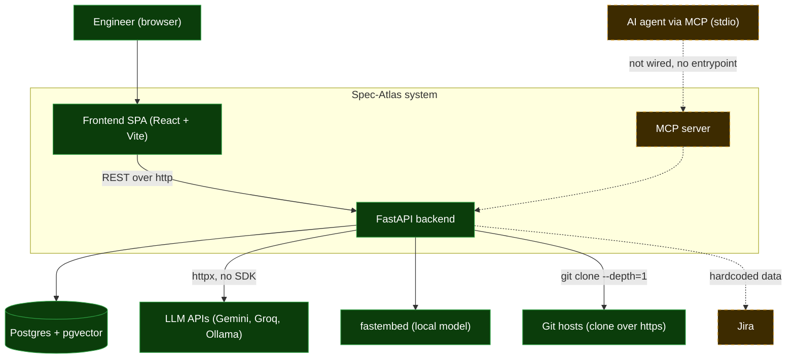

*Legend: solid green = real/wired; dashed amber = mock/not-wired.*

The **Engineer → Frontend → FastAPI → Postgres / LLM / git** path is real. Two integrations are mock: **Jira**
(hardcoded issues, `api/sources.py:92-142`) and the **MCP agent** path (the server exists but has no runnable entrypoint
and its handlers are partly broken — `mcp/handlers.py`, see §9). Git history is presented as a "source" but is also
hardcoded (`api/sources.py:30-66`); actual repo *cloning* for ingest is real (`ingest/resolver.py`).

---

## 3. Container / component view

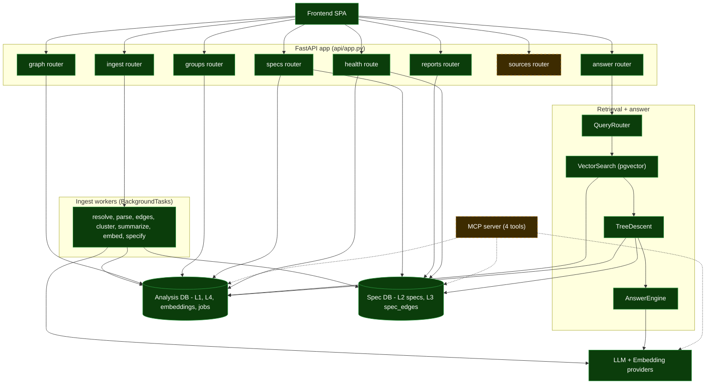

*Legend: solid = real; dashed = mock/not-wired. The MCP server is dashed because it has no entrypoint and broken handlers.*

Key facts verified from `api/app.py`:

- The app registers **seven routers** plus a plain `/health` route and a `/` root (`api/app.py:73-97`).
- **Two independent SQLAlchemy engines/session factories** are created — `analysis_session_factory` and
  `spec_session_factory` — each `None` if its URL is unset (`api/app.py:38-48`, `db/__init__.py`).
- Providers are constructed once at startup and stored on `app.state` (`api/app.py:50-60`).
- Ingest runs as a FastAPI **`BackgroundTask`** that offloads blocking work via `asyncio.to_thread`
  (`api/ingest.py:259-265`) — there is no external queue/worker process.
- CORS is wide-open (`allow_origins=["*"]`) in code, overriding the `ALLOWED_ORIGINS` setting (`api/app.py:62-70` vs
  `config.py:52-55`). *(Code wins: CORS is effectively unrestricted.)*

---

## 4. The multi-layer knowledge model (L1 → L2 → L3 → L4)

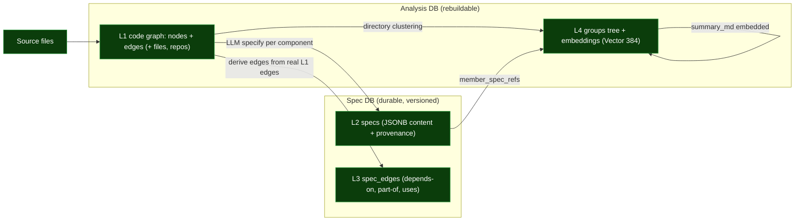

The layers are **physically split across two databases** (`db/__init__.py`): the **Analysis DB** is rebuildable
(disposable index), the **Spec DB** is durable and versioned. Cross-DB references are **by value** (loose `repo` /
`component_ref` strings), never foreign keys (`db/analysis.py:7`, `db/spec.py:4-6`).

| Layer | Meaning | Tables (DB) | Built by |
|---|---|---|---|
| **L1** | Code symbol graph | `repos`, `files`, `nodes`, `edges` (Analysis) | `parse/`, `graph/edges_intrafile.py`, `graph/edges_crossfile.py` |
| **L2** | Structured specs | `specs` (Spec) | `specify/engine.py`, `specify/batch_generator.py`, `spec/store.py` |
| **L3** | Spec dependency graph | `spec_edges` (Spec) | `specify/spec_graph_builder.py` |
| **L4** | Group hierarchy + vectors | `groups`, `embeddings` (Analysis) | `groups/clustering.py`, `groups/summarizer.py`, `embed/pipeline.py` |

Notes from code:
- **L1 node identity** is `(repo_id, language, qualified_name, kind)` (`db/analysis.py:80-83`); node `kind ∈
  {module, class, function, method}`, edge `kind ∈ {imports, calls, inherits, defines}` (`db/analysis.py:33-34`).
- **L3 edges are derived from real L1 edges**, never invented — `SpecEdge.derived_from` stores the originating L1 edge
  kind (`db/spec.py:68-83`, `specify/spec_graph_builder.py:112-120`).
- **L4 groups** are clustered from **directory structure**, not semantics (`groups/clustering.py:64-104`).
- **Embeddings** live only on **groups and specs** (`owner_kind ∈ {group, spec}`), never raw nodes
  (`db/analysis.py:156-173`), with `Vector(384)` (`EMBED_DIM = 384`).

---

## 5. Data model (ERD)

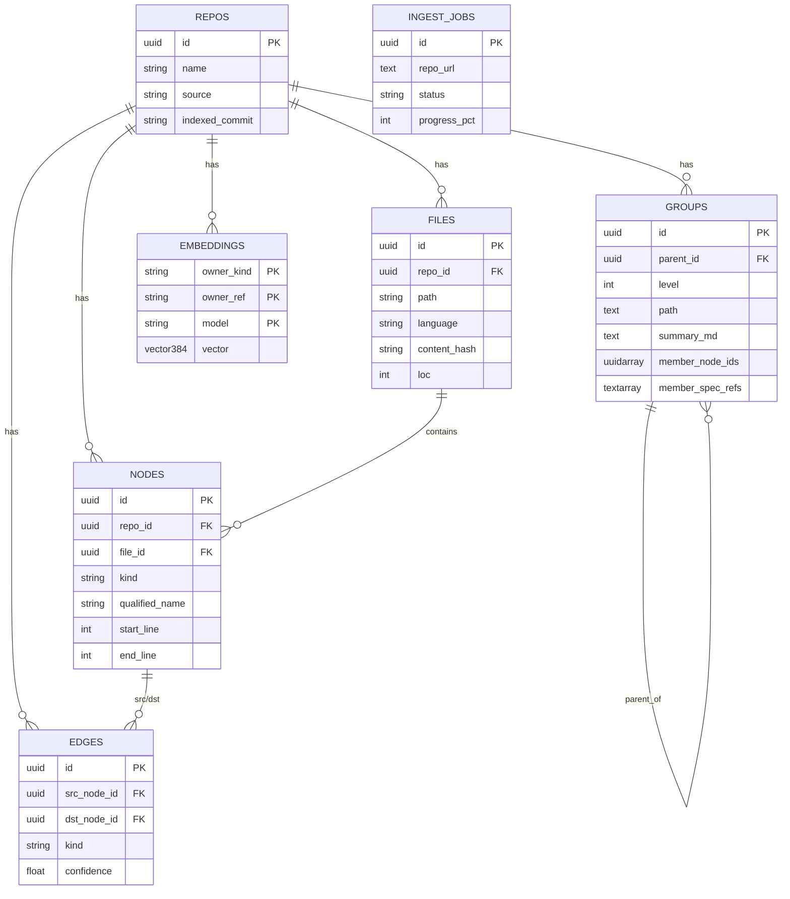

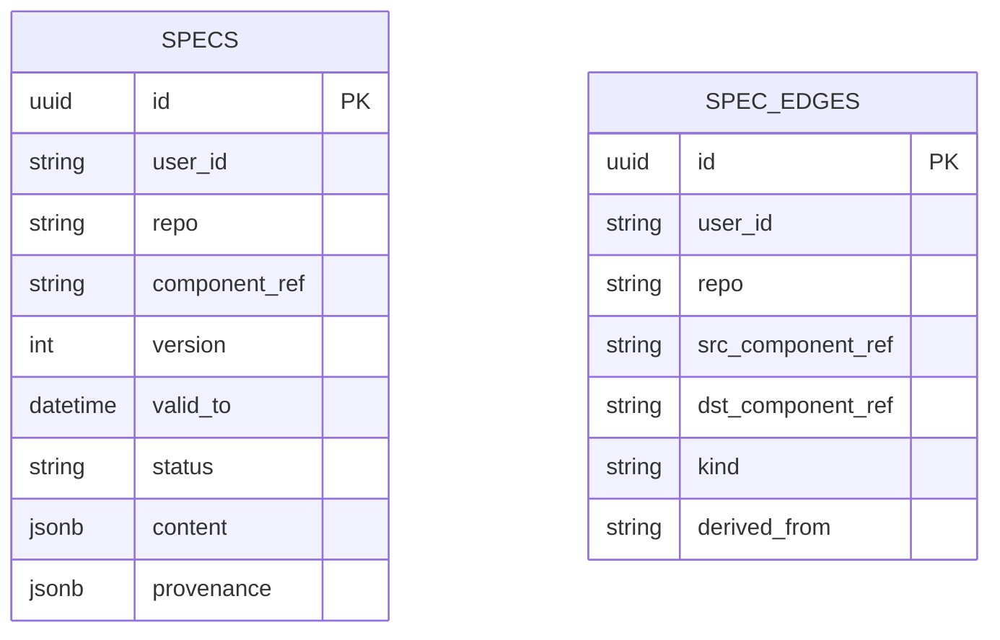

**Which DB:** `REPOS, FILES, NODES, EDGES, GROUPS, EMBEDDINGS, INGEST_JOBS` are in the **Analysis DB**
(`db/analysis.py`); `SPECS, SPEC_EDGES` are in the **Spec DB** (`db/spec.py`). There are **no cross-DB foreign keys** —
`GROUPS.member_spec_refs` and `SPECS.repo`/`component_ref` are loose string references by design.

Idempotency / versioning:
- `SPECS` are append-only versions: current = `valid_to IS NULL`; unique on `(user_id, repo, component_ref, version)`
  (`db/spec.py:43-47`). A new version sets the prior version's `valid_to` (`spec/store.py:67-71`).
- `EMBEDDINGS` PK is `(owner_kind, owner_ref, model)` — re-embedding a group overwrites by key.
- `NODES` are deduplicated on re-ingest by identity (`api/ingest.py:300-318`).

> **`source_units` is NOT a table.** `ingest/source_unit.py` defines a `SourceUnit` *dataclass* (with a `Provenance`
> dataclass and `SourceType` enum) intended for multi-format ingestion, but nothing persists it and no migration creates
> it. Persisting `SourceUnit`s is remediation **Phase 2** (`SYSTEM_STATUS_AND_REMEDIATION.md §4.12`).

---

## 6. Ingestion sequence

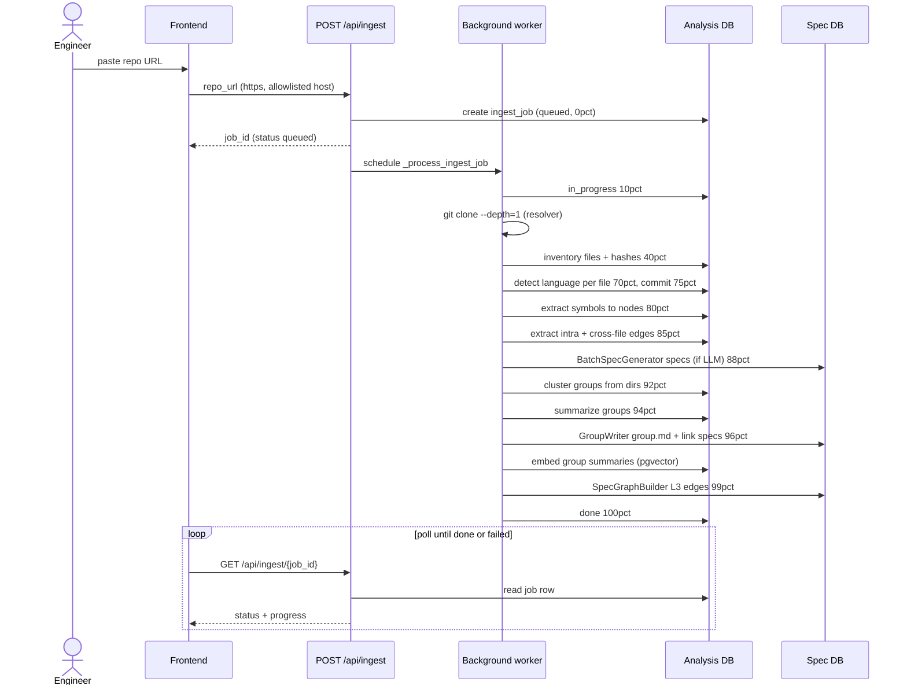

The progress percentages above are the **actual values written in `api/ingest.py:154-248`** (the module docstring lists
slightly different ranges — code wins). All phases run synchronously inside `_run_ingest_sync` on a worker thread.
Phases 6–10 (specs, groups, summarize, group.md, embeddings, spec-graph) are each wrapped in `try/except` and **skipped
on error so ingest still completes** (`api/ingest.py:182-246`).

Caveats verified in code:
- The endpoint accepts **only `https://` URLs to an allowlisted host set** `{github.com, gitlab.com, gitea.io,
  codeberg.org}` (`api/ingest.py:56,85-97`) — despite docstrings mentioning local paths, the local path is unreachable
  via the API.
- **Phase 8 summarize is a dead call**: `_summarize_groups` calls `GroupSummarizer.summarize(group, session)` (2 args)
  but the real signature takes 5 (`groups/summarizer.py:21-28`). It always raises and is swallowed; the *real*
  summaries are produced in Phase 8b by `GroupWriter` (`api/ingest.py:420-433`, remediation §3.10).
- **`group.md` is written into the temp clone dir** (`tempfile.mkdtemp`, `ingest/resolver.py:91`) which is discarded;
  the durable copy is `groups.summary_md` (`groups/group_writer.py:190-213`, remediation §3.11, Phase 2.13).
- **Document ingestion is not in this flow** — the pipeline only handles git/code; PDF/Excel/Markdown adapters are not
  invoked (see §13).

---

## 7. Query / RAG sequence (`POST /api/ask`)

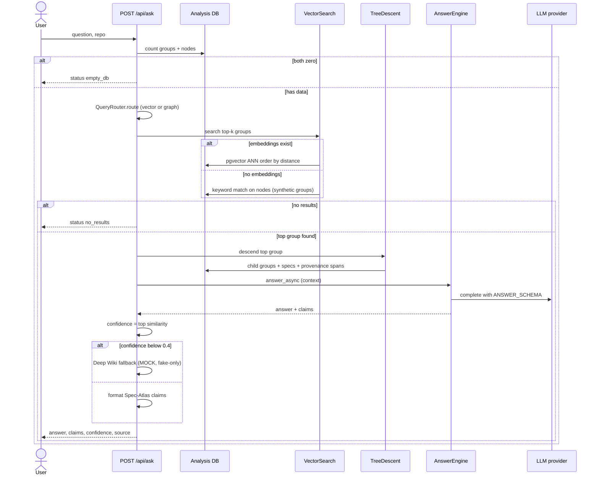

Pipeline modules: `QueryRouter.route` is a keyword heuristic returning `"graph_query"` or `"vector_search"`
(`retrieve/router.py:14-39`). `VectorSearch.search` does **real pgvector ANN** via the `<->` L2 operator over L4 group
embeddings, with a keyword fallback over nodes when no embeddings exist (`retrieve/search.py:50-89`). `TreeDescent`
collects child groups, member specs, and provenance source spans (`retrieve/descent.py:32-99`). `AnswerEngine` calls the
LLM with a JSON `ANSWER_SCHEMA` enforcing `{answer, claims[{claim, source}]}` (`answer/engine.py:15-38`).

Verified deltas (code is **newer** than the status report):

- ✅ **Confidence is now a real distance**, not a rank. `VectorSearch._vector_search` computes the Euclidean distance to
  the stored vector and maps it through `_distance_to_similarity` (`retrieve/search.py:84-87,145-157`). This
  **contradicts** the task brief's hint and `SYSTEM_STATUS_AND_REMEDIATION.md §3.4` (which described
  `1.0 - i*0.2`). *(Code wins.)*
- ⚠️ **Deep Wiki fallback is still MOCK** — only returns content when `LLM_PROVIDER=fake`, and only a canned
  `"Based on general knowledge…"` string with hardcoded `confidence: 0.3` (`api/answer.py:219-242`, remediation §3.3,
  Phase 3.16). The disclaimer it attaches is real UX, the content is not.
- ⚠️ **Sync/async provider mismatch.** `answer_async` does `await llm_provider.complete(...)` (`answer/engine.py:132`),
  but the `LLMProvider.complete` interface is **synchronous** (`llm/base.py:69-70`) and `FakeLLMProvider`/
  `GeminiLLMProvider` return plain values. Only `OllamaProvider`/`GroqProvider` define `async def complete`
  (`llm/ollama_provider.py:32,87`). So `/api/ask` works with the **async** providers but raises (caught →
  `status: error`) with the **default `fake`** provider. This is an unflagged code inconsistency — see §15.

---

## 8. Provider abstraction

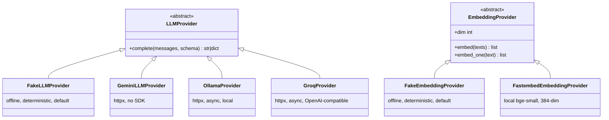

Every call goes through `LLMProvider` / `EmbeddingProvider`; **no vendor SDK is imported anywhere** — Gemini, Groq, and
Ollama all use raw `httpx` (`llm/gemini_provider.py:12-16`, `llm/ollama_provider.py:12-14`). Selection is by env
(`get_llm_provider`, `get_embedding_provider`).

**Default boot is fully offline** — `LLM_PROVIDER=fake` **and** `EMBED_PROVIDER=fake` (`config.py:40-41`,
`.env.example:14-15`). *(Correction to the brief: the embed default is `fake`, not `fastembed`. `fastembed` —
`BAAI/bge-small-en-v1.5`, 384-dim — is the local **real** option, opt-in via `EMBED_PROVIDER=fastembed`,
`embed/fastembed_provider.py:13-14`.)* The `Settings.offline` flag is true only when **both** are `fake`
(`config.py:65-68`).

A subtle model-name coupling: stored group/spec embeddings hardcode `model =
"sentence-transformers/all-MiniLM-L6-v2"` (`embed/pipeline.py:18`), and `VectorSearch.search` filters on that same
default model string (`retrieve/search.py:31,73-77`) — so ANN works regardless of the configured `EMBED_MODEL`, as long
as both stay aligned.

---

## 9. MCP / agent integration

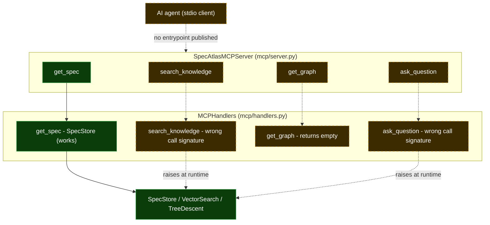

*Legend: solid = real; dashed = stub/broken/not-wired.*

The server **registers four tools with stable JSON schemas** — `search_knowledge`, `get_spec`, `get_graph`,
`ask_question` (`mcp/server.py:77-184`). Current handler state (`mcp/handlers.py`):

- `get_spec` is **real**: it calls `SpecStore.get_current/get_version` and returns the spec fields
  (`mcp/handlers.py:90-144`).
- `search_knowledge` and `ask_question` are **broken**: they construct `VectorSearch(self.analysis_session, …)` and
  `TreeDescent(self.analysis_session)` and call `.search(query, limit=…)` / `.retrieve(...)`, but those are **static
  methods with different signatures** (`retrieve/search.py:25`, `retrieve/descent.py:32`) — they raise at runtime and
  fall into the error branch. `ask_question` also hardcodes `confidence: 1.0` (remediation §3.7).
- `get_graph` always returns an **empty graph** (`mcp/handlers.py:166-175`, remediation §3.6).
- The server's handler-less branches return `"… not yet implemented"` stubs (`mcp/server.py:228-274`), and the legacy
  `MCPToolHandlers` is entirely stubbed.
- **No entrypoint exists.** There is no console script in `pyproject.toml`; `SpecAtlasMCPServer` is only constructed in
  tests. The UI instructs `uvx spec-atlas-mcp`, which is **not published** (remediation §3.8, Phase 4.17–4.18).

Rewriting the handlers to reuse the real `AnswerRouter`/`SpecStore`/`GraphStore` paths and adding an entrypoint is
remediation **Phase 4**.

---

## 10. Frontend architecture

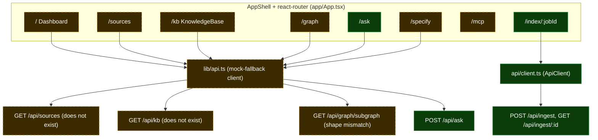

*Legend: solid = renders real backend data; dashed = falls back to `lib/mock.ts`.*

Stack: **React 18 + Vite + TypeScript**, `react-router-dom`, `@tanstack/react-query` (`app/App.tsx:1-42`,
`main.tsx`). Routes are code-split with `lazy`/`Suspense` (`app/App.tsx:21-27`).

**Two divergent API clients coexist** (remediation §3.24, Phase 0.2):
- `lib/api.ts` — a `client` object that **throws `MockFallback`** on any failure; pages catch it and render
  `lib/mock.ts`. Used by `lib/hooks.ts` and pages Dashboard/Sources/KB/Graph/Ask/Specify/MCP.
- `api/client.ts` — an `ApiClient` class that **throws real errors**. Used by the `api/use*` hooks and the legacy
  `/repo/*` pages, and (correctly) by the index-progress polling.

Their paths disagree: `lib/api.ts:131` polls `/api/ingest/:jobId/status` (does not exist) while `api/client.ts:202`
polls the correct `/api/ingest/:jobId`; `api/client.ts:293` calls `/api/graph/node/:id/neighbors` while the backend
serves `/api/graph/nodes/:id/neighbors` (`api/graph.py:146`).

**Why most pages render mock data** (all verified): `GET /api/sources`, `GET /api/sources/:id`, `GET /api/kb`,
`GET /api/kb/:ref`, and `POST /api/documents` **do not exist** in the backend (only routes in §11). `GET
/api/graph/subgraph` exists but **requires `node_id`** and returns a `NodeDetail` shape, not the `{id,label,layer,_x,_y,_z}`
the UI expects (`api/graph.py:192-237` vs `lib/api.ts:184-195`) → `MockFallback` → `MOCK_SUBGRAPH`.

**Graph rendering split:** the shipped `/graph` route renders a **2D canvas** `IsoGraph` (`pages/Graph.tsx:125`,
`components/graph/IsoGraph.tsx`). The **THREE.js** `scene/GraphScene.tsx` (with `useGraphBuild`) **is never mounted by
any route** — only `RepoGraphify` on a legacy `/repo/*` route uses `three` directly. Pointing `/graph` at `GraphScene`
over a real layered subgraph endpoint is remediation **Phase 1.8**.

Genuinely real-data paths today: **`/index/:jobId`** progress (via `api/useIndexJob.ts` → real `/api/ingest/:jobId`) and
the **`/api/ingest`** trigger. `/ask` reaches the real endpoint but the answer with the default `fake` provider hits the
sync/async issue (§7), and "streaming" is a `setTimeout` reveal (remediation §3.21).

---

## 11. Endpoint reference

`METHOD /path` → feature → handler module → state. *(REAL = queries the DB / does real work; MOCK = hardcoded/stub.)*

| Method & Path | Feature | Handler module | State |
|---|---|---|---|
| `POST /api/ingest` | Start repo ingest job | `api/ingest.py:456` | **REAL** |
| `GET /api/ingest/{job_id}` | Poll ingest job | `api/ingest.py:504` | **REAL** |
| `POST /api/ask` | Q&A over codebase | `api/answer.py:275` | **REAL** (Deep-Wiki branch MOCK; fake-provider await caveat) |
| `GET /api/graph/nodes/{node_id}` | Node detail | `api/graph.py:121` | **REAL** |
| `GET /api/graph/nodes/{node_id}/neighbors` | Node neighbors | `api/graph.py:146` | **REAL** |
| `GET /api/graph/subgraph` | Neighborhood subgraph | `api/graph.py:192` | **REAL** (shape ≠ frontend) |
| `GET /api/graph/nodes` | All nodes (viz) | `api/graph.py:260` | **REAL** |
| `GET /api/graph/edges` | All edges (viz) | `api/graph.py:287` | **REAL** |
| `GET /api/graph/search` | Search nodes by name | `api/graph.py:307` | **REAL** |
| `POST /api/graph/reachable` | Path existence | `api/graph.py:341` | **REAL** (returns no path array) |
| `GET /api/groups` | Group tree | `api/groups.py:95` | **REAL** (resolves `repo`→`repo_id`) |
| `GET /api/groups/{group_id}` | Group detail | `api/groups.py:150` | **REAL** |
| `POST /api/specs` | Create spec version | `api/specs.py:98` | **REAL** |
| `GET /api/specs/{component_ref}` | Current spec | `api/specs.py:133` | **REAL** |
| `GET /api/specs/{component_ref}/versions` | Version list | `api/specs.py:164` | **REAL** |
| `GET /api/specs/{component_ref}/v/{version}` | Specific version | `api/specs.py:192` | **REAL** |
| `PATCH /api/specs/{component_ref}` | Update status | `api/specs.py:225` | **REAL** |
| `POST /api/specs/generate/{component_ref}` | Generate-on-demand spec | `api/specs.py:282` | **REAL** |
| `GET /api/specs/graph/{component_ref}` | Spec deps/dependents | `api/specs.py:390` | **REAL** |
| `POST /api/specs/{component_ref}/verify` | Verify spec grounding | `api/specs.py:490` | **REAL** |
| `GET /api/specs/project-specs` | List project specs | `api/specs.py:557` | **REAL but SHADOWED** by `/{component_ref}` |
| `GET /api/specs/project-notes` | Get notes | `api/specs.py:623` | **REAL but SHADOWED** |
| `POST /api/specs/project-notes` | Save notes | `api/specs.py:587` | **REAL** |
| `GET /api/reports/verification` | Verification stats | `api/reports.py:63` | **REAL** |
| `GET /api/reports/verification/issues` | Top issues | `api/reports.py:88` | **REAL** |
| `GET /api/reports/verification/confidence` | Confidence histogram | `api/reports.py:117` | **REAL** |
| `GET /api/git/history` | Git commit history | `api/sources.py:14` | **MOCK** (hardcoded) |
| `GET /api/jira/issues` | Jira issues | `api/sources.py:76` | **MOCK** (hardcoded) |
| `GET /health` | Health + provider status | `api/health.py:61` | **REAL** |
| `GET /` | Service banner | `api/app.py:95` | **REAL** |
| MCP `get_spec` | Spec lookup tool | `mcp/handlers.py:90` | **REAL** (no entrypoint) |
| MCP `search_knowledge` | Search tool | `mcp/handlers.py:43` | **BROKEN** (bad signature) |
| MCP `ask_question` | Q&A tool | `mcp/handlers.py:185` | **BROKEN** (bad signature) |
| MCP `get_graph` | Graph tool | `mcp/handlers.py:146` | **STUB** (empty) |

> Routing bug: `GET /api/specs/project-specs` and `GET /api/specs/project-notes` are registered **after**
> `GET /api/specs/{component_ref}`, so FastAPI matches them as `component_ref="project-specs"/"project-notes"` → 404.
> The `POST /api/specs/project-notes` is fine (different method). Endpoints the frontend expects but that **do not
> exist**: `GET /api/sources`, `GET /api/sources/:id`, `GET /api/kb`, `GET /api/kb/:ref`, `POST /api/documents`,
> `GET /api/projects/:id/sources`, `GET /api/projects/:id/specs`.

---

## 12. Deployment & runtime topology

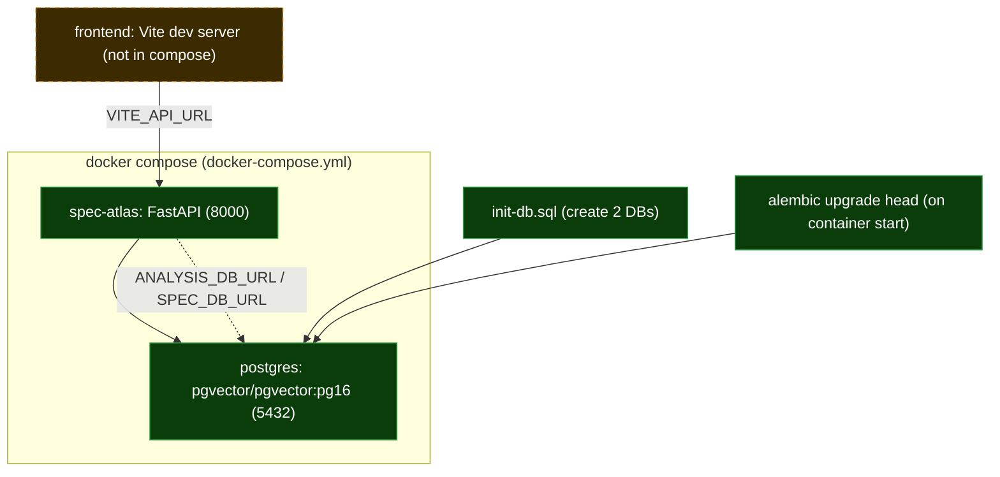

`docker-compose.yml` defines **two services**: `postgres` (pgvector pg16) and `spec-atlas` (the API). **The frontend is
not in compose** — it runs separately (Vite dev server), pointing at the API via `VITE_API_URL` (defaults to
`http://localhost:8000` in both clients). *(Correction to the brief, which expected a frontend compose service.)*

- **Startup:** the API container runs `alembic upgrade head && uvicorn …` (`Dockerfile` CMD). The image installs `git`
  (for `RepoResolver` clones), `curl` (healthcheck), and `postgresql-client`.
- **Two databases on one Postgres:** `init-db.sql` creates `spec_atlas_analysis` and `spec_atlas_spec`; the URLs are
  passed as `ANALYSIS_DB_URL` / `SPEC_DB_URL` (`docker-compose.yml:34-35`). Migrations are **multi-DB** — alembic
  dispatches `upgrade_analysis()` / `upgrade_spec()` per engine, and enables the `vector` extension before creating
  `embeddings.vector(384)` (`migrations/versions/0001_initial.py:36-52`).
- **Provider modes:** compose ships `LLM_PROVIDER=groq` + `EMBED_PROVIDER=fake` (`docker-compose.yml:37-40`) — i.e.
  *not* the all-fake default; running compose requires a `GROQ_API_KEY`. The code/`.env.example` default for local dev
  and CI is **fully offline** (`fake`/`fake`).
- **DB optional at boot:** the app boots even without DB URLs — session factories become `None` and DB-backed endpoints
  return `503` (`api/app.py:41-48`, `db/__init__.py:52-58`). Health reports `degraded`/`503` when a DB is unreachable
  (`api/health.py:77-82`).

---

## 13. Cross-cutting concerns

**Provenance contract.** Specs persist a `provenance` list of `{file, start_line, end_line}` spans
(`db/spec.py:60-61`), and answer claims carry a `source` locator (`file:line`, `document:page`, `ticket:KEY`,
`commit:sha` — `ingest/source_unit.py:28`, `answer/engine.py:24-37`). **Known weakness:** generated spec provenance puts
`str(focal_node.file_id)` (a UUID) in the `file` field instead of the path (`specify/engine.py:149`,
`groups/summarizer.py` — remediation §3.9, Phase 0.5). Document page/cell/section provenance is defined in the
`SourceUnit` dataclass but not yet persisted (Phase 2).

**Confidence scoring.** `/api/ask` confidence = the top group's vector similarity, now derived from the real pgvector
`<->` distance via `_distance_to_similarity` (clamped to `[0,1]`, `retrieve/search.py:145-157`). Below `0.4` the
(mock) Deep-Wiki branch triggers. Spec verification produces an independent confidence (`verify/verifier.py`).

**Document adapters.** `ingest/adapters/` provides `PDFAdapter` (PyMuPDF), an Excel adapter (openpyxl), a Markdown
adapter, and a code adapter behind an abstract `SourceAdapter.ingest()` (`ingest/adapters/base.py`). **They are not
wired into the ingest pipeline** — `_run_ingest_sync` only processes git/code (`api/ingest.py`). Closing this is
remediation **Phase 2**.

**Rate limiting.** `slowapi` is imported and a `Limiter` is constructed, but `_apply_rate_limit` is a **no-op**
decorator on both `/api/ingest` and `/api/ask` with a "fix slowapi compatibility" TODO (`api/ingest.py:73-77`,
`api/answer.py:268-272`). SSRF/path-traversal guards on ingest **are** active (`api/ingest.py:56-97`).

**Testing strategy.** ~**376 test functions across 48 files** under `tests/` (count via `grep`), and the suite is
**fully offline** — `fake` LLM + `fake`/`fastembed` embeddings, no network, no keys (`config.py` defaults,
`llm/fake.py`, `embed/fake.py`). This enforces the zero-cost NFR.

**Security / NFR.** CORS is wide-open in code (`allow_origins=["*"]`, `api/app.py:65`) — overrides `ALLOWED_ORIGINS`.
Ingest enforces an https-only host allowlist and resolves file paths against traversal (`api/ingest.py:59-97`). No
secrets are committed; `.env` is gitignored.

---

## 14. Tech stack inventory (USP-bearing dependencies)

| Dependency | Role | Used in |
|---|---|---|
| `fastapi` + `uvicorn` | HTTP API + ASGI server | `api/app.py`, `Dockerfile` |
| `sqlalchemy` 2.0 | ORM for the two DBs | `db/analysis.py`, `db/spec.py` |
| `alembic` | Multi-DB migrations | `migrations/` |
| `psycopg` (v3) | Postgres driver | `db/__init__.py:48` (URLs) |
| `pgvector` | `Vector(384)` column + `<->` ANN | `db/analysis.py:15,173`, `retrieve/search.py:75` |
| `pydantic` / `pydantic-settings` | Request models + env config | `config.py`, every router |
| `tree-sitter` + `tree-sitter-python` | Python CST parsing (symbols) | `parse/treesitter.py`, `parse/python_symbols.py` |
| `httpx` | All real provider HTTP (no SDK) | `llm/gemini_provider.py`, `llm/ollama_provider.py` |
| `fastembed` | Local zero-cost embeddings (bge-small) | `embed/fastembed_provider.py` |
| `jsonschema` | Validate structured LLM output | `llm/base.py:16,55-59` |
| `tenacity` | Transient-error retry/backoff | `llm/base.py:17-52` |
| `PyMuPDF` / `openpyxl` | PDF / Excel adapters | `ingest/adapters/pdf.py`, `ingest/adapters/excel.py` |
| `mcp` (optional) | MCP server SDK (stubbed if absent) | `mcp/server.py:11-17` |
| `slowapi` (optional) | Rate limiting (imported, disabled) | `api/answer.py`, `api/ingest.py` |
| React 18 + Vite + TS | Frontend SPA | `frontend/` |
| `react-router-dom` | Routing | `app/App.tsx` |
| `@tanstack/react-query` | Server-state cache | `app/App.tsx:35-42`, `api/use*.ts` |
| `three` | 3D graph scene (not mounted) | `components/scene/GraphScene.tsx`, `pages/RepoGraphify.tsx` |

> **TS/JS parsing is regex, not tree-sitter.** Despite docstrings, `TypeScriptSymbolExtractor.extract` uses
> `re.finditer` over function/class patterns (`parse/ts_symbols.py:36-62`); cross-file TS edges are likewise regex
> (`graph/edges_crossfile.py`). Only **Python** uses tree-sitter. Migrating TS/JS to tree-sitter is remediation
> **Phase 5.22**. *(Code wins over the "via tree-sitter" docstring.)*

---

## 15. Known gaps / spec-vs-code deltas

Honest list of what is specified or claimed but **mocked, broken, or not wired** (each verified in code):

1. **Git-history & Jira sources are hardcoded** (`api/sources.py`) — no real `git log` or Jira call. *(Phase 3)*
2. **Deep Wiki fallback is a canned string**, fake-provider-only (`api/answer.py:219-242`). *(Phase 3.16)*
3. **MCP `search_knowledge`/`ask_question` are broken** (call static methods with wrong signatures);
   **`get_graph` returns empty**; **no MCP entrypoint** exists (`mcp/handlers.py`, `mcp/server.py`). *(Phase 4)*
4. **Document ingestion not wired** — PDF/Excel/Markdown adapters exist but the pipeline ingests only git/code; `POST
   /api/documents` does not exist; the UI's document path dead-ends in a `mock-document-*` job → 404. *(Phase 2)*
5. **`source_units` is a dataclass, not a table** — multi-source provenance (page/cell/section) is not persisted or
   retrievable. *(Phase 2.12)*
6. **Frontend renders mock for most pages** — Dashboard/Sources/KnowledgeBase/Graph/Specify/MCP fall back to
   `lib/mock.ts` because their endpoints don't exist or shape-mismatch. *(Phase 1)*
7. **Two divergent API clients** with inconsistent paths (`lib/api.ts` vs `api/client.ts`). *(Phase 0.2)*
8. **THREE.js `GraphScene` is not mounted** — `/graph` ships a 2D canvas. *(Phase 1.8)*
9. **Spec provenance stores a file UUID, not a path** (`specify/engine.py:149`). *(Phase 0.5)*
10. **Dead `summarize` call** in ingest (wrong arity, silently swallowed) — Phase-8 summarization is effectively done by
    `GroupWriter` in Phase 8b (`api/ingest.py:425`). *(Phase 0.5)*
11. **`group.md` written to an ephemeral temp clone** that is discarded (`groups/group_writer.py`). *(Phase 2.13)*
12. **Rate limiting is disabled** (no-op decorators) despite `slowapi` being present. *(Phase 5.23)*
13. **`/api/specs/project-specs` and `GET /api/specs/project-notes` are route-shadowed** by `/{component_ref}` → 404.
14. **CORS is wide open** in code (`allow_origins=["*"]`), overriding `ALLOWED_ORIGINS`.
15. **`/api/ask` await/sync mismatch** — `answer_async` awaits a synchronous `complete`, so it errors with the default
    `fake` (and `gemini`) provider; works only with the async `ollama`/`groq` providers (`answer/engine.py:132` vs
    `llm/base.py:69`). *(Not currently tracked in the remediation plan.)*
16. **TS/JS parsing is regex**, not tree-sitter (`parse/ts_symbols.py`). *(Phase 5.22)*

Deltas where the **code is ahead of the older status report** (these are now REAL — do not treat as mock):

- **Answer confidence is a real pgvector distance**, not a rank (`retrieve/search.py:84-87,145-157`) — supersedes
  `SYSTEM_STATUS_AND_REMEDIATION.md §3.4` and the task brief's hint about `search.py:77`.
- **Groups API resolves `repo`→`repo_id`** via name/UUID lookup; there is no placeholder UUID (`api/groups.py:71-92`)
  — supersedes §3.5.

---

*Generated by reading the code at `main` (`94c38f5`).*

**Mermaid validation:** all **11** diagrams were parsed with `mermaid@11` (`mermaid.parse`, `securityLevel: loose`,
headless via jsdom) — **11/11 OK**. One fix was applied during validation: a flowchart node id `graph` collided with a
reserved keyword and was renamed `graphPg`.
