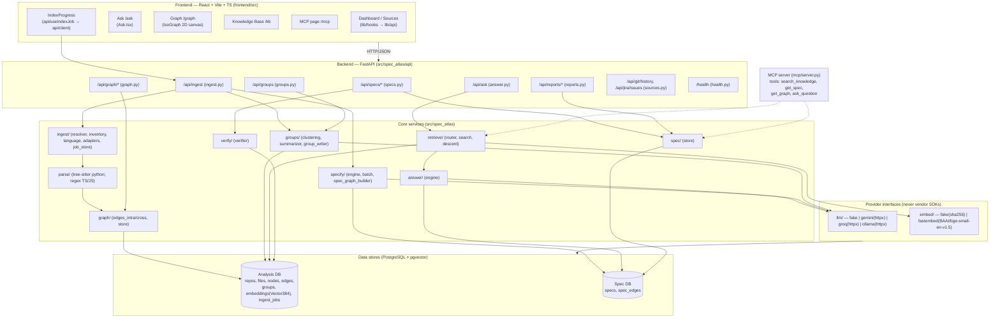

# Spec-Atlas — Product Overview

> *"From what the code is to what the code means."* — `src/spec_atlas/api/app.py:30`

This document is a 0→100 walkthrough of the Spec-Atlas platform. It describes what the product is, why it exists, and what it does — then maps every feature to the modules, files, and API routes that implement it. Every claim cites a real path. Where the spec describes something the code does not yet do, it is called out under **Specified but not implemented**.

---

## What is Spec-Atlas

Spec-Atlas is an **Industrial Knowledge Intelligence platform** — an "Operations Brain" that turns scattered engineering knowledge (source code, PDFs, Excel sheets, Markdown, and — by design — Jira and git history) into a single, **grounded, cited, explorable knowledge graph**. You point it at a repository or drop in a document; it parses everything into structured symbols and source units, generates structured **specs** ("Knowledge Cards") and group summaries with an LLM, links them into a layered graph, and lets you **ask questions in natural language and get answers where every claim carries a `{file, start_line, end_line}` receipt**.

**The problem it solves.** Engineering knowledge is fragmented across code, design docs, spreadsheets, and ticket systems, and it goes stale the moment it's written. Nobody can answer "what does this component actually do, and where is that true?" without spelunking. Spec-Atlas makes that knowledge queryable and **provenance-mandatory**: no answer, no spec field, without a source span (`CLAUDE.md` global rule; `specs/architecture/ARCHITECTURE.md`).

**Who it's for.** Engineers onboarding to an unfamiliar codebase, teams maintaining large industrial/legacy systems, and AI agents (via the MCP server) that need grounded, structured context instead of raw file dumps.

---

## Why it exists — the mission

The mission is to **convert multi-source, multi-format industrial knowledge into a layered, grounded intelligence graph** that stays tied to its sources. Concretely:

- **Multi-source by design.** Code is a first-class source, but so are PDFs, Excel workbooks, and Markdown — each has a dedicated adapter that produces `SourceUnit`s with precise locators (`src/spec_atlas/ingest/adapters/`). The product vision additionally names **Jira and git history** as sources (`specs/architecture/INTEGRATIONS.md`, `src/spec_atlas/api/sources.py`).
- **Grounded, not generative-guesswork.** Every spec field and every answer claim must point back to a source span. This is enforced as a cross-cutting contract (`CLAUDE.md`; provenance objects throughout `src/spec_atlas/specify/`, `src/spec_atlas/answer/`).
- **Zero-cost / offline-first.** Both the LLM and embedding layers default to **`fake`** providers so the system boots, runs, and tests with no network, no credentials, and no cost (`src/spec_atlas/config.py:40-41,66-68`). Real providers (Gemini, Groq, Ollama, fastembed) are opt-in and reached only through a provider interface — **never a vendor SDK directly** (`src/spec_atlas/llm/`, `src/spec_atlas/embed/`).

---

## What it does — the core USP

> **Index any repository and ingest your documents into one referenced, queryable knowledge base, then explore it as a 3-layer graph and ask it grounded, cited questions — locally and for free.**

The USP is the combination of (1) a **multi-layer Graph RAG** over heterogeneous sources, (2) **automatic spec generation** that distills code regions into structured cards, and (3) **mandatory provenance** so every output is traceable to a file, page, or cell — all exposed both to humans (web UI) and to agents (MCP server).

---

## Feature Showcase

### 1. Three-layer Graph RAG (L1 / L3 / L4) with vector search on the top layer

**User value.** Ask a big-picture question and Spec-Atlas finds the right *region* of knowledge (top layer), then descends into the specs and exact source spans beneath it to compose a grounded answer — instead of doing flat keyword search over files.

**The layers** (`specs/architecture/ARCHITECTURE.md`, `src/spec_atlas/db/analysis.py`, `src/spec_atlas/db/spec.py`):

| Layer | Meaning | Where it lives |
|-------|---------|----------------|
| **L1 — Code graph** | Symbols (functions/classes) + edges (calls/imports) | `nodes`, `edges` tables (`db/analysis.py:79,103`) |
| **L2 — Specs** | Structured Knowledge Cards per component | `specs` table (`db/spec.py:42`) |
| **L3 — Spec graph** | Dependency edges between specs (derived from L1) | `spec_edges` (`db/spec.py:71`), built by `specify/spec_graph_builder.py` |
| **L4 — Groups** | Hierarchical clusters (by directory) with summaries + embeddings | `groups`, `embeddings` tables (`db/analysis.py:128,162`) |

**How retrieval works** (`src/spec_atlas/retrieve/`):
1. **Route** the query — keyword heuristic picks `graph_query` vs `vector_search` (`retrieve/router.py:15-39`).
2. **Vector search the top layer** — embed the query and run pgvector ANN (`<->`) over **group (L4) embeddings**; if no embeddings exist, fall back to keyword matching on L1 nodes (`retrieve/search.py:53-135`). The vector column is `Vector(384)` (`db/analysis.py:173`).
3. **Tree descent** — from the matched group, collect member specs and their provenance spans within bounds (`retrieve/descent.py:32-99`).
4. **Answer** — see feature 8.

Served by `POST /api/ask` (`src/spec_atlas/api/answer.py:275`) and the graph query endpoints in `src/spec_atlas/api/graph.py`.

### 2. Spec generation (Specify)

**User value.** Auto-generate a structured "Knowledge Card" for any code component — purpose, inputs, outputs, dependencies, invariants, side-effects, failure modes — each bound to source spans, with no manual writing.

**Implementation.**
- `SpecifyEngine.generate()` builds a prompt from a focal node + neighbors + edges, calls the LLM with a **JSON Schema** (structured output), validates it, extracts interconnections, and builds provenance (`src/spec_atlas/specify/engine.py:18-66`; schema in `specify/schema.py`).
- **Batch generation at index time** across a whole repo: `BatchSpecGenerator.generate_for_repo()` (`src/spec_atlas/specify/batch_generator.py`).
- **Generate-on-demand** with caching: `POST /api/specs/generate/{component_ref}` returns the cached spec if it exists, else generates v1 and persists it (`src/spec_atlas/api/specs.py:282-377`).
- **Versioned storage** with `valid_from`/`valid_to` history and idempotent dependency edges: `SpecStore` (`src/spec_atlas/spec/store.py:29-101`).

### 3. Persistent AI storage (ingested knowledge → persistent Markdown)

**User value.** What the AI learns about your code is persisted as human-readable, source-cited Markdown that the platform AI reuses for retrieval — not regenerated on every query.

**Implementation.**
- **Group summaries** (L4) are LLM-generated Markdown with provenance and a content fingerprint, persisted to `groups.summary_md` (`src/spec_atlas/groups/summarizer.py:21-59,181-205`).
- `GroupWriter` writes `group.md` files and links specs to groups during indexing (`src/spec_atlas/groups/group_writer.py:24-149`).
- **Specs** are persisted as structured JSON (`specs.content`) and exposed as Markdown cards through the API.

> **Caveat (verify against code):** `GroupWriter` writes `group.md` into the cloned repo's working directory (`group_writer.py:190-213`), which for git sources is a **temp clone** (`ingest/resolver.py:91`) and is ephemeral. The *durable* persistent store is the database (`groups.summary_md`, `specs.content`), not the on-disk `.md` files. See `SYSTEM_STATUS_AND_REMEDIATION.md`.

### 4. Graph Explorer view (3D, interactive, inspector)

**User value.** See your knowledge as a navigable graph — sources at the bottom, cards in the middle, domains on top — with vertical "provenance beams" connecting a source to the card to the domain, plus a side inspector.

**Implementation.**
- Live route `/graph` → `frontend/src/pages/Graph.tsx` renders **`IsoGraph`** (`frontend/src/components/graph/IsoGraph.tsx`), a **2D `<canvas>` isometric renderer** with manual 3D projection (`project3D`, `IsoGraph.tsx:45-75`), drag-to-rotate, scroll-zoom, and **distance-based hit detection** for hover/click (`IsoGraph.tsx:201-280`).
- `Inspector` side panel shows the selected node and lets you jump to neighbors (`frontend/src/components/graph/Inspector.tsx`).
- A **separate THREE.js renderer** with true raycasting exists in `frontend/src/components/scene/GraphScene.tsx` + `useGraphBuild.ts` (Three.js `import` confirmed in `frontend/src/pages/RepoGraphify.tsx`), but it is wired only to the **legacy** `/repo/:id/graphify` and `/repo/:id/explore` routes, not the primary `/graph` page (`frontend/src/app/App.tsx:68-73`).
- Backend graph data: `GET /api/graph/{nodes,edges,subgraph,search}` + neighbors/reachability (`src/spec_atlas/api/graph.py`), backed by `GraphStore` BFS/subgraph/reachability (`src/spec_atlas/graph/store.py`).

> The "THREE.js + raycasting" experience is implemented (`scene/`) but the shipped `/graph` page uses the 2D canvas `IsoGraph` and is fed **mock** layer data — see remediation report.

### 5. MCP server (tools agents can call)

**User value.** Any MCP-compatible agent (e.g. Claude Code) connects to your knowledge base and calls stable, frozen tools for retrieval and exploration.

**Implementation.**
- `SpecAtlasMCPServer` registers four tools with stable JSON schemas: **`search_knowledge`**, **`get_spec`**, **`get_graph`**, **`ask_question`** (`src/spec_atlas/mcp/server.py:77-187`). It uses the real `mcp` SDK if installed, else falls back to in-process stub classes for testing (`server.py:11-58`).
- `MCPHandlers` is the intended DB-backed implementation wiring tools to `VectorSearch`, `TreeDescent`, `AnswerEngine`, and `SpecStore` (`src/spec_atlas/mcp/handlers.py:20-225`).
- Frontend marketing/playground at `/mcp` (`frontend/src/pages/MCPServer.tsx`) with copy-paste client config.

> **Reality check:** the tool *schemas* and server scaffold are real and tested (`tests/mcp/`), but `MCPHandlers` has signature mismatches against the static `VectorSearch`/`TreeDescent` APIs and `get_graph` returns an empty stub; there is also no runnable entrypoint that constructs the server with real handlers. See remediation report §Mocked.

### 6. Chat interface (grounded, cited answers + Deep Wiki fallback)

**User value.** Ask questions in plain language; get an answer plus citation chips you can click to the exact source. When the codebase doesn't cover the question, fall back to general knowledge ("Deep Wiki") with a clear disclaimer.

**Implementation.**
- Live route `/ask` → `frontend/src/pages/Ask.tsx` → `client.ask()` → `POST /api/ask`.
- `AnswerRouter.answer()` orchestrates empty-DB checks, routing, vector search, tree descent, LLM answer, and the **Deep Wiki fallback** triggered when confidence < 0.4 (`src/spec_atlas/api/answer.py:102-242`).
- Structured answers (`answer` + `claims[]` with sources) come from `AnswerEngine` using a JSON Schema (`src/spec_atlas/answer/engine.py:14-159`).

> **Reality check:** Deep Wiki is **mocked** — it returns a canned string in `fake` mode and was never integrated with a real Deep Wiki service (`answer.py:219-242`). Answer **confidence is rank-derived**, not a true similarity score (`retrieve/search.py:77-79`). Frontend answer "streaming" is a `setTimeout` animation, not real SSE (`Ask.tsx:76`).

### 7. Document ingestion & conversion pipeline

**User value.** Drop a PDF, Excel sheet, or Markdown file and it becomes searchable knowledge with cell/page/section-level citations.

**Implementation.**
- Adapters produce `SourceUnit`s with precise locators (`src/spec_atlas/ingest/adapters/`):
  - **PDF** → one unit per page, `…:p.{n}` (PyMuPDF/`fitz`) — `adapters/pdf.py`.
  - **Excel** → one unit per row, `…:sheet={s}:row={r}` (openpyxl) — `adapters/excel.py`.
  - **Markdown** → one unit per heading section — `adapters/markdown.py`.
  - **Code** → `adapters/code.py`.
- The **code/repo** pipeline is fully wired (`src/spec_atlas/api/ingest.py:133-256`): resolve (shallow `git clone`, `ingest/resolver.py`) → inventory + hashes (`ingest/inventory.py`) → language detection (`ingest/language.py`) → symbol extraction → edges → batch specs → groups → summaries → embeddings → spec graph. Job state is persisted in `ingest_jobs` (`ingest/job_store.py`), survives restarts, and runs off the event loop via `asyncio.to_thread`.

> **Reality check:** the **document adapters are not wired into any ingest path or API** — a grep shows `SourceUnit`/adapters are referenced only within `ingest/adapters/` itself. There is no `POST /api/documents` endpoint; the frontend's document upload falls back to a mock job. See remediation report.

### 8. Verifier engine / confidence + drift detection

**User value.** Know whether a spec still matches the code: each claim is checked against the graph, scored for confidence, and marked `verified` / `review` / `draft`. Stale knowledge should be flagged when code changes.

**Implementation.**
- **Rule-based verifier** `SpecVerifier` checks purpose/input/output/dependency claims against nodes, signatures, and edges, applying confidence penalties per ungrounded claim (`src/spec_atlas/verify/verifier.py:36-306`).
- **Idempotent verification** with cached metadata and status transitions (`>0.8 → verified`, `≥0.5 → review`, else `draft`) in `SpecStore.verify_spec()` (`src/spec_atlas/spec/store.py:220-314`).
- **Reporting**: verification rate, top issues, confidence histogram (`src/spec_atlas/api/reports.py`; `spec/store.py:316-465`).
- Endpoint: `POST /api/specs/{component_ref}/verify` (`api/specs.py:490-554`).

> **Specified but not implemented — Drift detection (F-014).** The feature spec `specs/features/F-014-drift-detection.md` is "ready," and the Dashboard UI advertises "Drift detection flags stale cards when code changes" (`frontend/src/pages/Dashboard.tsx:110-111`), but there is **no drift implementation anywhere in `src/`** (no `DriftDetector`, no `staleness_detected_at` writer). Verification (point-in-time grounding) exists; *automatic drift on re-ingest* does not.

---

## Technical Deep-Dive

### System architecture



### Ingestion → parsing → embedding → graph → retrieval → answer

```mermaid
sequenceDiagram
    autonumber
    actor User
    participant FE as Frontend (OmniIngest / Ask)
    participant API as FastAPI
    participant ING as ingest._run_ingest_sync
    participant PARSE as parse/* (tree-sitter)
    participant GR as graph/edges_*
    participant SPEC as specify/batch_generator
    participant GRP as groups/* (+ embed)
    participant ADB as Analysis DB
    participant SDB as Spec DB
    participant RET as retrieve/*
    participant LLM as LLMProvider

    Note over User,SDB: INDEX TIME
    User->>FE: paste repo URL → Index
    FE->>API: POST /api/ingest {repo_url}
    API->>ING: BackgroundTask (asyncio.to_thread)
    ING->>ING: resolve_git (shallow clone) + inventory + language detect
    ING->>PARSE: extract symbols (Python: tree-sitter; TS/JS: regex)
    PARSE->>ADB: Node rows (10→80%)
    ING->>GR: intra/cross-file edges
    GR->>ADB: Edge rows (→85%)
    ING->>SPEC: generate specs per node (LLM, JSON schema)
    SPEC->>SDB: Spec rows (→88%)
    ING->>GRP: cluster by directory → summarize (LLM) → write group.md → embed
    GRP->>ADB: Group + Embedding(Vector384) rows (→98%)
    ING->>SDB: SpecGraphBuilder: L3 edges from L1 edges (→99%)
    ING->>ADB: ingest_jobs.status = done (100%)
    FE->>API: GET /api/ingest/{job_id} (poll via useIndexJob)

    Note over User,LLM: QUERY TIME
    User->>FE: ask question
    FE->>API: POST /api/ask {question}
    API->>RET: QueryRouter.route → VectorSearch (pgvector <->) on L4 groups
    RET->>ADB: top-k group embeddings (fallback: keyword on nodes)
    RET->>RET: TreeDescent: collect member specs + provenance spans
    API->>LLM: AnswerEngine.answer_async (JSON schema: answer + claims[])
    LLM-->>API: {answer, claims[{claim, source}]}
    alt confidence < 0.4
        API->>API: Deep Wiki fallback (MOCK) + disclaimer
    end
    API-->>FE: AskResponse {answer, claims, confidence, status}
```

### Calling routes → feature → handler

| Endpoint | Feature | Handler module |
|----------|---------|----------------|
| `POST /api/ingest` | Repo ingestion (start job) | `api/ingest.py:456` → `_process_ingest_job` |
| `GET /api/ingest/{job_id}` | Index progress polling | `api/ingest.py:504` (`IngestJobStore`) |
| `POST /api/ask` | Chat / Graph RAG answer | `api/answer.py:275` → `AnswerRouter` |
| `GET /api/graph/nodes` `…/edges` `…/subgraph` `…/search` | Graph Explorer data | `api/graph.py` → `GraphStore` |
| `GET /api/graph/nodes/{id}/neighbors`, `POST /api/graph/reachable` | Graph navigation / reachability | `api/graph.py:146,341` |
| `POST /api/specs/generate/{component_ref}` | Specify (generate-on-demand) | `api/specs.py:282` → `SpecifyEngine` |
| `POST /api/specs`, `GET /api/specs/{ref}`, `…/versions`, `…/v/{n}`, `PATCH` | Spec CRUD + versioning | `api/specs.py` → `SpecStore` |
| `GET /api/specs/graph/{ref}` | L3 spec graph (deps/dependents) | `api/specs.py:390` |
| `POST /api/specs/{ref}/verify` | Verifier engine | `api/specs.py:490` → `SpecStore.verify_spec` → `SpecVerifier` |
| `GET /api/reports/verification`, `…/issues`, `…/confidence` | Verification analytics | `api/reports.py` → `SpecStore` |
| `GET /api/groups`, `GET /api/groups/{id}` | L4 group browsing | `api/groups.py` → `GroupClustering` |
| `GET /api/git/history`, `GET /api/jira/issues` | External sources (Jira/git) | `api/sources.py` *(mocked)* |
| `GET /health` | Health: DBs + providers | `api/health.py:61` |
| MCP `search_knowledge` / `get_spec` / `get_graph` / `ask_question` | Agent tools | `mcp/server.py`, `mcp/handlers.py` |

### Tech stack inventory (USP-implementing dependencies)

**Backend (Python, `pyproject.toml`)**
- **FastAPI** — HTTP API, routers, CORS (`api/app.py:8,28,63`).
- **SQLAlchemy 2.x + psycopg3** — ORM and two independent engines (`db/__init__.py:12-49`).
- **pgvector** (`pgvector.sqlalchemy.Vector`) — 384-dim embedding column + `<->` ANN search (`db/analysis.py:15,173`; `retrieve/search.py:71`).
- **tree-sitter** + **tree-sitter-python** — real Python CST parsing (`parse/treesitter.py:12-31`, `parse/python_symbols.py`). *(TS/JS uses `re` regex, `parse/ts_symbols.py:36-75`; cross-file edges use `re`, `graph/edges_crossfile.py`.)*
- **PyMuPDF (`fitz`)** — PDF extraction (`ingest/adapters/pdf.py:7`).
- **openpyxl** — Excel extraction (`ingest/adapters/excel.py:7`).
- **httpx** — all real LLM providers, **no vendor SDKs** (`llm/gemini_provider.py:12`, `llm/ollama_provider.py:12` for Ollama + Groq).
- **fastembed** (`BAAI/bge-small-en-v1.5`, CPU) — local embeddings, lazy-loaded (`embed/fastembed_provider.py:29-31`).
- **pydantic / pydantic-settings** — env-validated config (`config.py`).
- **mcp** SDK (optional) — agent server transport (`mcp/server.py:12`).
- **Alembic** — migrations (`migrations/versions/0001_initial.py`, `0002_ingest_jobs_table.py`).
- **slowapi** (optional) — rate limiting *(imported but disabled; `api/ingest.py:73-77`, `api/answer.py:268-272`)*.

**External / internal API calls behind the provider interfaces**
- **Google Gemini** REST (`generativelanguage.googleapis.com`) via httpx — `llm/gemini_provider.py:16,57-73`.
- **Groq** OpenAI-compatible REST (`api.groq.com`) via httpx — `llm/ollama_provider.py:80`.
- **Ollama** local REST (`localhost:11434`) via httpx — `llm/ollama_provider.py:42-51`.
- **Deep Wiki** — *referenced as a fallback but mocked, no real call* (`api/answer.py:219-242`).
- **Jira / git history** — *spec'd sources, currently hardcoded responses* (`api/sources.py`).

**Frontend (`frontend/package.json`)**
- **React 18 + Vite 5 + TypeScript** — SPA.
- **react-router-dom 6** — routing (`app/App.tsx`).
- **@tanstack/react-query 5** — data fetching/caching (`lib/hooks.ts`, `api/useIndexJob.ts`).
- **three 0.184** — 3D graph scene (`components/scene/GraphScene.tsx`, used by legacy `RepoGraphify`/`RepoExplore`).
- **HTML5 Canvas 2D** — the *shipped* `/graph` isometric renderer (`components/graph/IsoGraph.tsx`).
- **react-markdown**, **lucide-react** — card rendering and icons.
- Two API clients coexist: `frontend/src/lib/api.ts` (mock-fallback client used by the new IA pages) and `frontend/src/api/client.ts` (`ApiClient`, throws on error, used by `useIndexJob`).

---

## Specified but not implemented (spec ≠ code)

- **Drift detection (F-014)** — spec "ready"; advertised in the UI; **no `src/` implementation** (no `DriftDetector`, no `staleness_detected_at`). `specs/features/F-014-drift-detection.md`.
- **Eval harness (F-016)** — `tests/eval/` contains only `fixtures/`; no eval source module. `specs/features/F-016-eval-harness.md`.
- **Document ingestion end-to-end** — PDF/Excel/Markdown adapters exist but are **not wired** into any ingest path or `POST /api/documents` endpoint.
- **Jira & git-history sources** — `INTEGRATIONS.md` describes them; `api/sources.py` returns **hardcoded mock data**.
- **Deep Wiki fallback** — wired as a branch but returns a **mock** string; no real integration.
- **Rate limiting** — `slowapi` is imported but the decorators are no-ops (`_apply_rate_limit` returns the function unchanged).
- **THREE.js Graph Explorer on the main route** — real Three.js scene exists but the shipped `/graph` route uses the 2D canvas `IsoGraph` fed by mock data.

A full, file-by-file audit of what is real vs. mocked — and the plan to close each gap — is in **`SYSTEM_STATUS_AND_REMEDIATION.md`**.
